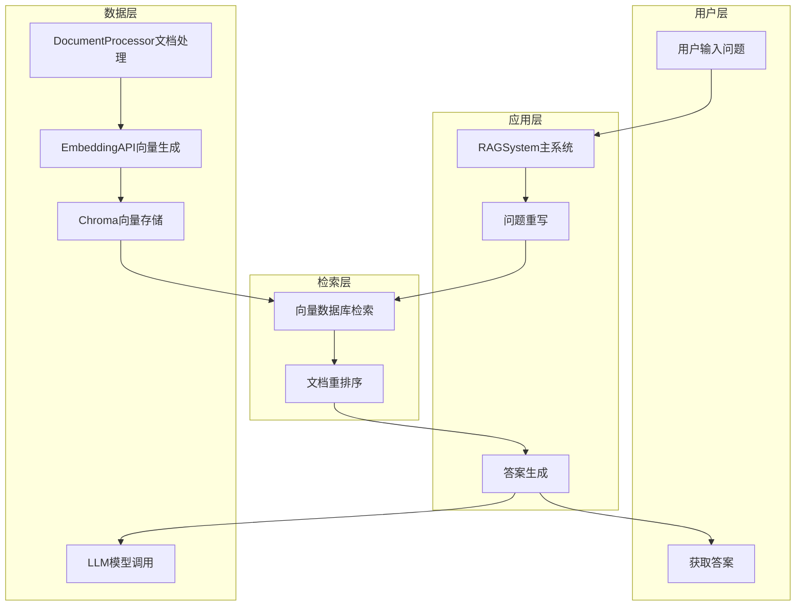

# 408-RAG 项目分析报告

## 1. 项目全景文档

### 1.1 概述

408-RAG 是一个基于本地知识库的智能问答系统，专为计算机（408）考研设计。它利用检索增强生成（RAG）技术，结合 Chroma 向量数据库和大型语言模型（如 Qwen3），提供精准、高效的考点检索、真题解析和智能问答功能。

### 1.2 技术栈

- **后端语言**：Python 3.12
- **核心库**：LangChain、OpenAI API、NumPy
- **向量数据库**：Chroma
- **文档处理**：PyMuPDF（PDF）、UnstructuredMarkdownLoader（Markdown）
- **环境管理**：dotenv
- **构建工具**：pip
- **部署方式**：本地部署

### 1.3 系统架构拓扑

### 1.4 核心文件

1. **src/rag/rag_main.py**
   - 系统主入口，协调各个模块的工作
   - 实现了知识库构建和查询功能
   - 支持多轮对话
   - 关键类：`RAGSystem`，包含 `build_knowledge_base` 和 `query` 方法

2. **src/rag/document_processor.py**
   - 负责文档的加载和分割
   - 支持多种文档格式（PDF、Markdown）
   - 提供多种文本分割策略：默认、按章节、按论文格式
   - 关键类：`DocumentProcessor`，包含 `process_documents` 方法

3. **src/rag/vector_db.py**
   - 负责向量的存储和检索
   - 使用 Chroma 作为向量数据库
   - 支持相似度搜索和 MMR 搜索
   - 关键类：`VectorDatabase`，包含 `create_from_documents` 和 `similarity_search` 方法

4. **src/rag/embedding_apis.py**
   - 负责生成文本向量
   - 使用 OpenAI API 或兼容服务
   - 支持批量生成向量
   - 关键类：`OpenAIEmbedding`，包含 `embed_documents` 和 `embed_query` 方法

5. **src/rag/llm_apis.py**
   - 负责调用语言模型生成答案
   - 支持问题重写和多轮对话
   - 关键类：`LLMClient`，包含 `rewrite_question` 和 `generate_answer` 方法

6. **src/rag/reranker.py**
   - 负责对检索到的文档进行重排序
   - 基于关键词匹配和语义相似度
   - 关键类：`SimpleReranker`，包含 `rerank` 和 `_calculate_score` 方法

### 1.5 进一步阅读

- [LangChain 官方文档](https://python.langchain.com/docs/get_started/introduction)
- [Chroma 向量数据库文档](https://docs.trychroma.com/)
- [OpenAI API 文档](https://platform.openai.com/docs/api-reference)

## 2. 保姆级学习路径

### 2.1 项目复杂度评估

- **文件夹数量**：10+ 个文件夹
- **依赖项**：10+ 个依赖库
- **抽象层**：3-4 层（应用层、检索层、数据层）
- **总体复杂度**：中等

### 2.2 Day-1 起点

**起点文件**：`requirements.txt` 和 `.env`

**目标**：了解项目依赖和配置，确保环境搭建成功

**步骤**：
1. 检查 `requirements.txt` 文件，了解项目依赖
2. 查看 `.env` 文件，了解环境变量配置
3. 安装依赖：`pip install -r requirements.txt`
4. 配置环境变量：复制 `.env` 文件并填写必要的 API 密钥

### 2.3 1天微课程

**概念**：RAG 系统的核心组件和工作流程

**学习内容**：
1. RAG 系统的基本原理
2. 文档处理和分割策略
3. 向量数据库的使用
4. LLM 模型的调用

**实践任务**：添加一个简单的日志记录功能，在查询过程中记录更详细的信息

**具体步骤**：
1. 打开 `src/rag/rag_main.py` 文件
2. 在 `query` 方法中，在生成答案前后添加详细的日志记录
3. 运行系统，验证日志是否正确输出

**成功标准**：
- 系统能够正常运行
- 日志中包含详细的查询过程信息
- 能够正确回答示例问题

### 2.4 第二天学习建议

**概念**：文档分割策略和向量检索优化

**学习内容**：
1. 不同文档分割策略的优缺点
2. 向量检索参数的调优
3. 重排序算法的原理

**实践任务**：实现一个新的文档分割策略，针对代码文件进行优化

**具体步骤**：
1. 在 `src/rag/document_processor.py` 中添加一个新的文本分割器
2. 配置系统使用新的分割策略
3. 测试分割效果和查询准确性

**成功标准**：
- 新的分割策略能够正确处理代码文件
- 系统查询准确性有所提高
- 分割后的文档块大小合理

### 2.5 第三天学习建议

**概念**：多轮对话和上下文管理

**学习内容**：
1. 对话历史的管理
2. 上下文窗口的优化
3. 问题重写的技巧

**实践任务**：实现一个更智能的问题重写功能，能够更好地理解上下文

**具体步骤**：
1. 修改 `src/rag/llm_apis.py` 中的 `rewrite_question` 方法
2. 优化提示词，提高问题重写的质量
3. 测试多轮对话的效果

**成功标准**：
- 多轮对话中能够正确理解上下文
- 问题重写后的表述更加清晰准确
- 系统能够处理更复杂的对话场景

## 3. 安全注意事项

- **API 密钥安全**：确保 `.env` 文件中的 API 密钥不会被提交到版本控制系统
- **数据隐私**：本地部署确保数据不被外部服务获取
- **输入验证**：系统应添加输入验证，防止恶意输入
- **资源限制**：应设置合理的请求频率限制，避免 API 调用过多导致费用过高

---

Need a deeper doc or extra learning days? Just ask.