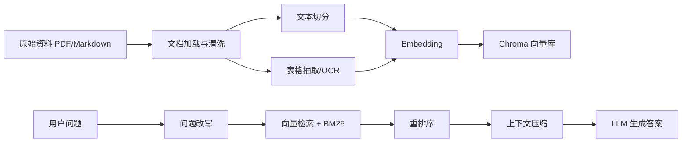

# 408-RAG

一个面向计算机考研 408 的本地知识库 RAG 问答系统。项目将教材、真题解析和知识点资料切分为可检索的知识块，通过向量检索、BM25 混合检索、重排序和大模型生成，为数据结构、计算机组成原理、操作系统、计算机网络等科目提供问答与选择题辅助。

## 项目特点

- **面向 408 场景**：提示词、知识库组织和测试数据均围绕考研 408 四科设计。
- **本地知识库检索**：使用 Chroma 持久化向量库，支持重复加载已有知识库。
- **混合检索与重排序**：结合向量相似度、BM25 关键词检索和简单重排序，提高上下文命中质量。
- **多轮问答**：支持基于对话历史的问题改写，使追问更加完整。
- **PDF 内容增强**：支持 PDF 文本解析、表格抽取，并可选用 Tesseract OCR 提取图片文字。
- **OpenAI 兼容接口**：可接入 SiliconFlow、OpenAI 或其他兼容 OpenAI API 的模型服务。

## 技术栈

- Python 3.11
- LangChain / LangChain Community
- ChromaDB
- OpenAI Python SDK
- rank-bm25 / NLTK
- PyMuPDF / pdfplumber / pytesseract
- python-dotenv

## 工作流程



## 目录结构

```text
.
├── data/
│   └── test_data/              # 选择题评测数据
├── data_base/
│   ├── knowledge_db/           # 本地知识库资料，默认不提交到 GitHub
│   └── vector_db/              # Chroma 向量库，默认不提交到 GitHub
├── output/                     # 切分结果与评测输出，默认不提交到 GitHub
├── src/
│   ├── rag/
│   │   ├── rag_main.py         # RAG 系统入口
│   │   ├── document_processor.py
│   │   ├── vector_db.py
│   │   ├── llm_apis.py
│   │   ├── embedding_apis.py
│   │   ├── reranker.py
│   │   └── ocr_processor.py
│   ├── preprocess/             # 数据预处理脚本
│   └── eval/                   # RAG 评测脚本
├── pyproject.toml
├── requirements.txt
└── README.md
```

## 快速开始

### 1. 克隆项目

```bash
git clone https://github.com/1an-P/-RAG-408-.git
cd 408-RAG
```

### 2. 创建环境

推荐使用 Python 3.11。

```bash
python -m venv .venv
.\.venv\Scripts\activate
pip install -r requirements.txt
```

如果使用 `uv`：

```bash
uv sync
```

### 3. 配置环境变量

在项目根目录创建 `.env` 文件：

```env
OPENAI_API_KEY=your_api_key
OPENAI_BASE_URL=https://api.siliconflow.cn/v1
LLM_MODEL_NAME=qwen3-max
```

说明：

- `OPENAI_API_KEY`：模型服务 API Key。
- `OPENAI_BASE_URL`：OpenAI 兼容接口地址，例如 SiliconFlow。
- `LLM_MODEL_NAME`：对话模型名称，未设置时默认使用 `qwen3-max`。
- Embedding 默认使用 `text-embedding-v1`，可在 `src/rag/embedding_apis.py` 中调整。

请不要将 `.env` 上传到 GitHub。

### 4. 准备知识库

将 PDF 或 Markdown 资料放入：

```text
data_base/knowledge_db/
```

项目会在首次运行时构建向量库，并持久化到：

```text
data_base/vector_db/408.db
```

`data_base/` 默认已加入 `.gitignore`，适合存放教材、真题解析等不便公开的资料。

### 5. 运行示例

```bash
python -m src.rag.rag_main
```

或者：

```bash
uv run python -m src.rag.rag_main
```

程序会自动检查向量库是否存在。如果不存在，会先读取 `data_base/knowledge_db/` 构建知识库，然后执行示例问题。

## 使用方式

可以在代码中直接调用 `RAGSystem`：

```python
from src.rag.rag_main import RAGSystem

rag = RAGSystem(
    persist_dir="data_base/vector_db/408.db",
    strategy="chapter",
    alpha=0.5,
)

answer = rag.query(
    "请解释操作系统中的进程、线程以及二者的区别。",
    k=3,
    use_hybrid=True,
)

print(answer)
```

常用参数：

- `strategy`：文本切分策略，支持 `default`、`chapter`、`paper`。
- `alpha`：混合检索权重，控制 BM25 与向量检索的融合比例。
- `k`：最终交给模型的上下文块数量。
- `use_hybrid`：是否启用 BM25 + 向量混合检索。
- `use_mmr`：是否使用 MMR 检索。
- `fallback_to_llm`：知识库不足时是否直接调用大模型回答。
- `test_mode`：选择题评测模式，只要求输出选项字母。

## OCR 与表格抽取

构建知识库时可以对 PDF 做额外处理：

- 使用 `pdfplumber` 抽取 PDF 表格，并转为 Markdown 表格参与检索。
- 使用 `pytesseract` 对 PDF 内嵌图片做 OCR，提取图片文字。

开关位于 `RAGSystem` 初始化参数：

```python
rag = RAGSystem(
    persist_dir="data_base/vector_db/408.db",
    strategy="chapter",
    use_ocr=True,
    use_table_extraction=True,
)
```

如需启用 OCR，请先在本机安装 Tesseract OCR 及对应语言包。

## 评测

项目提供了 400 题选择题评测脚本：

```bash
python -m src.eval.test_rag_system
```

已有测试记录：

| 模型 | 数据集 | 正确率 |
| --- | --- | --- |
| qwen3:8b | 400 题选择题 | 91.62% (361/394) |

评测结果会输出到 `output/` 目录。由于模型、知识库版本、检索参数和 API 服务都会影响结果，上表仅作为当前实验记录。

## 数据说明

题目来源包括：

- assistant408 题目
- 408 1000 题
- 王道选择题
- 深入浅出计算机网络习题
- 计算机网络每日一题

知识库资料包括：

- 王道 408 考研系列资料
- 408 历年真题解析
- 408 易错点、冷门知识点整理

由于部分资料可能涉及版权，仓库默认不提交 `data_base/`、`output/`、PDF、DOCX 等文件。上传 GitHub 前请确认公开内容不包含敏感信息或受版权限制的材料。

## 后续计划

- 增加命令行交互入口，避免每次修改 `rag_main.py`。
- 增加可配置的 Embedding 模型名称。
- 优化中文 BM25 分词，目前英文停用词处理对中文场景仍较粗糙。
- 增加更稳定的评测脚本和结果汇总。
- 为知识库构建流程补充缓存与增量更新能力。

## License

本项目基于 GPL-3.0 License 开源，详见 [LICENSE](LICENSE)。
